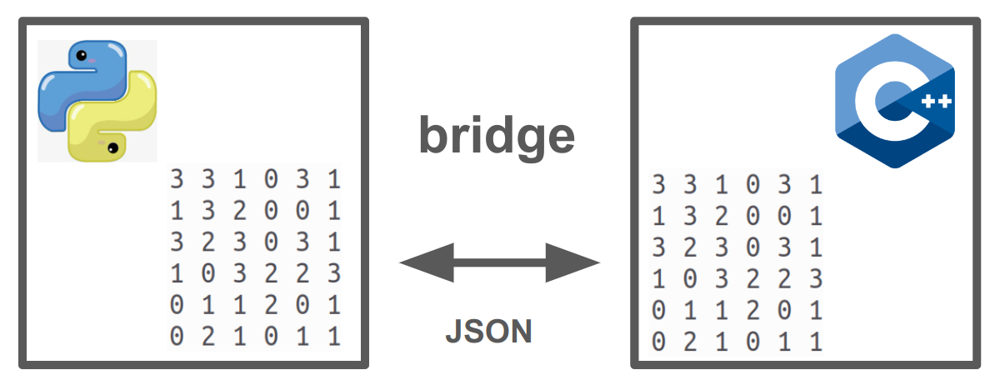

# bridge


This is an open-source suite of mini-libraries designed to connect array data between Python and C++ through the use of JSON files.
Python and C++ modules use **tojson** and **jsonload** functions to convert [one- two- and three-dimensional] arrays to .json DOK (Dictionary of Keys) and viceversa, respectively. See Usage Examples below.

## Contributions Welcome / Hacktoberfest

Meaningful contributions to the project are always welcome. Participating in Hacktoberfest 2022. Before making a PR, please make sure to read the [CONTRIBUTING](./CONTRIBUTING.md) document.

You may use the Issues section of this repository if you'd like to propose some new ideas/enhancements or report a bug.


## Installation / Setup

### Dependencies

#### [JSON for Modern C++](https://github.com/nlohmann/json)

```ruby
# Download JSON repository
git clone https://github.com/nlohmann/json.git

# Access it
cd json

#copy as system variable
sudo cp -R include/nlohmann/ /usr/include/nlohmann
```

### Bridge suite

```ruby
# Download this repository
git clone https://github.com/andrewrgarcia/bridge.git

# Access it
cd bridge

#copy as system variable to call bridge.cpp from anywhere
sudo cp -R include/garcia/ /usr/include/garcia

# Get Python mini-library ("ponte")
pip install ponte

```

## Usage Examples

**C++**

```ruby
#include <iostream>
#include <vector>
#include <stdio.h>
#include <garcia/bridge.hpp>

int main()
{
    // CREATE A VECTORIZED ARRAY
    std::vector<int> vector0(8, 1);
    std::vector<int> DIMS = {2, 2, 2};
    std::string filename{"sample.json"};
    // pack vector to .json file
    tojson(filename, vector0, DIMS);

    // PROCESS JSON FILE BACK TO VECTOR
    std::vector<int> vector = jsonload(filename);
    // print vector
    std::cout << "\nvectorized array: " << std::endl;
    for (int i = 0; i < vector.size(); i++)
    {
        std::cout << vector[i] << " ";
    }
    std::cout << std::endl;
}
```

**Python**

```python
import ponte as bridge
import numpy as np

'CREATE A 1-D VECTOR'
X = np.random.choice([0,1,2,3],10,p=[0.7,0.1,0.1,0.1])
'pack vector to .json file'
bridge.tojson('sample.json',X)

'PROCESS JSON FILE BACK TO VECTOR'
array_form = bridge.jsonload('sample.json')
'print vector'
print('array:\n',array_form)
```

## Sample Output

```ruby
array to DOK:
{
	"map": [
		[1],
		[4],
		[5],
		[8],
		[9]
	],
	"value": [2, 3, 2, 2, 2],
	"odims": [10]
}

DOK to array:
[0. 2. 0. 0. 3. 2. 0. 0. 2. 2.]
```
